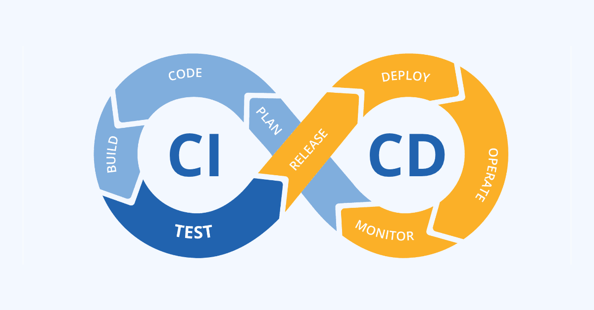
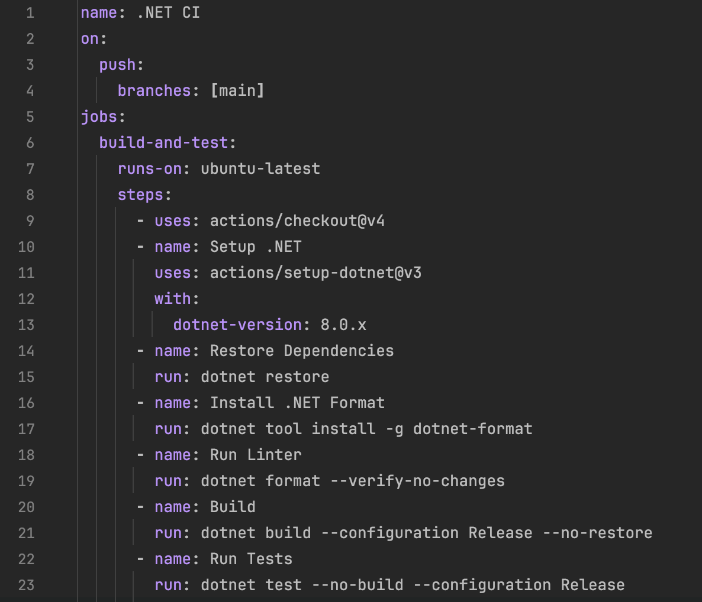
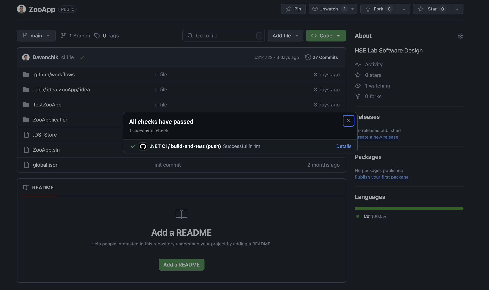
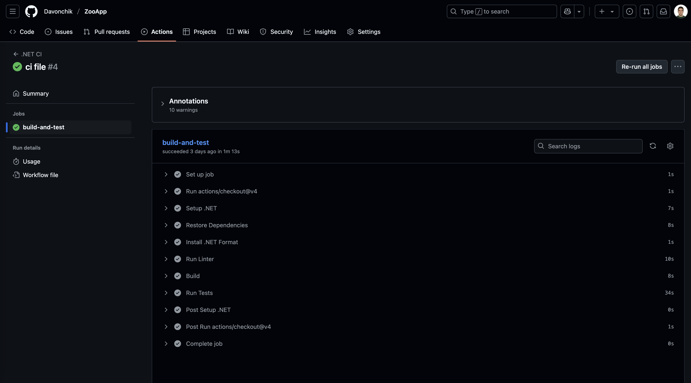
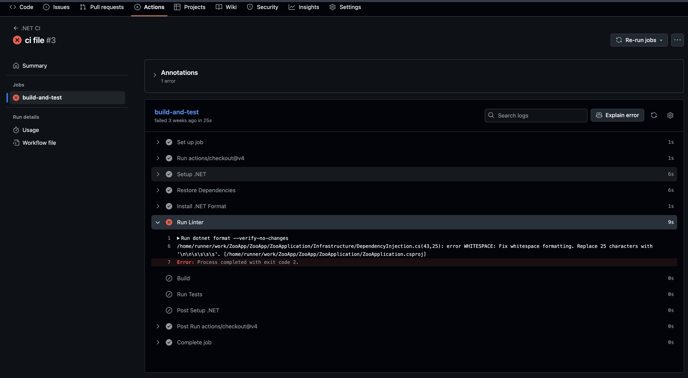

# Введение в CI/CD (Continuous Integration / Continuous Delivery)

## Немного общей теории
**CI/CD** – это подход к разработке ПО, при котором рутинные процессы сборки, тестирования и развертывания автоматизированы. 

Процесс **CI/CD** часто называют **конвейером** **(pipeline)**, где исходный код на входе превращается в готовое приложение на выходе. Такой конвейер выступает в роли «робота-помощника», который берёт на себя скучные задачи: запускает тесты, собирает проект, выкладывает его на сервер. 

**Цель CI/CD** – ускорить и упростить доставку изменений в программном обеспечении, организуя высокое качество и надежность релизов.

**Рассмотрим схему:**



*На схеме показан бесконечный цикл CI/CD:*

Слева этапы **Continuous Integration: Code → Build → Test** — код пишется, автоматически собирается и проверяется.

Через мостик **Plan / Release** изменения переходят к **Continuous Delivery/Deployment (правая часть): Deploy → Operate → Monitor**. Здесь артефакт развёртывается, приложение работает в продакшене и непрерывно отслеживается. При полном непрерывном развертывании деплой на рабочий сервер выполняется автоматически сразу после успешных тестов и релиза.

## Непрерывная интеграция (CI) – Continuous Integration

**Continuous Integration (CI) или непрерывная интеграция** – практика разработки, при которой изменения в коде регулярно сливаются в общую кодовую базу и автоматически проверяются. Идея в том, чтобы интегрировать работу нескольких разработчиков как можно чаще, избегая «интеграционного ада», когда накопившиеся изменения трудно объединить.

Каждый коммит в репозиторий может запускать автоматическую сборку проекта, запуск линтеров, серию тестов и другое. Это позволяет сразу обнаружить, если новое изменение сломало сборку или тесты. 

Основные черты CI:
- Частое слияние кода – разработчики интегрируют изменения в основную ветку ежедневно (а то и несколько раз в день) .
- Автоматическое тестирование – при каждом коммите запускаются юнит-тесты, линтеры и другие проверки качества кода .
- Быстрая обратная связь – если сборка или тесты падают, команда узнаёт об этом сразу, а не спустя недели на этапе релиза .

**Цель непрерывной интеграции** – убедиться, что после каждого изменения проект по-прежнему собирается и проходит тесты, то есть «ничего не сломалось». Это повышает уверенность в коде и позволяет находить и исправлять баги на ранней стадии разработки.

## Непрерывная доставка и развёртывание (CD) – Continuous Delivery / Deployment

**Continuous Delivery (CD)** – непрерывная доставка – расширяет CI следующим шагом: после успешной интеграции и тестирования система автоматически подготавливает приложение к выпуску. Результатом может быть готовый артефакт (например, собранный исполняемый файл или контейнер с приложением), который потенциально готов к развёртыванию. Однако на этапе delivery обычно присутствует ручное одобрение перед выкаткой на продакшен. Проще говоря, непрерывная доставка гарантирует, что код успешно прошёл все проверки и может быть развёрнут, когда будет принято решение о релизе.

**Continuous Deployment – непрерывное развертывание** – это следующий уровень автоматизации. Здесь обновление автоматически выкатывается на целевую среду (например, в продакшен) без ручного участия, сразу после прохождения всех тестов и проверок. При правильно настроенном процессе **deployment** каждое изменение, прошедшее **pipeline**, сразу оказывается у пользователей.

**Важно понимать разницу:** непрерывная доставка обеспечивает автоматизацию вплоть до этапа готовности релиза, но оставляет финальное решение о выпуске человеку, тогда как непрерывное развёртывание устраняет этот ручной шаг, проводя деплой автоматически. В обоих случаях сокращается время между написанием кода и получением этого кода пользователями.

**Преимущества CD:** Автоматизация доставки и деплоя позволяет выпускать обновления чаще и стабильнее. Ручных шагов меньше, значит, ниже риск ошибок и минимизируется время простоя при релизах. Команда может быстрее получать обратную связь от пользователей и гибко реагировать на неё, что повышает качество продукта и удовлетворённость пользователей.

## От теории к практике — выбираем инструмент автоматизации

Теперь, когда **принципы CI/CD** понятны, самое время перейти к их реальному воплощению. На рынке существует целый набор платформ, которые позволяют настроить конвейер сборки, тестирования и доставки: **Jenkins, GitLab CI, Azure Pipelines, CircleCI и другие.** Мы же остановимся на **GitHub Actions** — встроенном решении прямо в экосистеме **GitHub**.

*Почему GitHub Actions?*
- Нулевой порог входа: всё уже интегрировано в ваш репозиторий — запускается буквально парой YAML-файлов.
- Быстро для публичных и небольших учебных проектов.
- [Marketplace](https://github.com/marketplace?type=actions) c тысячами готовых actions: можно быстро подключить линтер, сборку, деплой на любой хостинг и даже публикацию релизов.
- Простота масштабирования: начинать можно с одного шага «собрать и протестировать», а потом постепенно добавлять кэширование, статический анализ, CD-этапы и т.д.

**Ниже разберём, как именно настроить минимальный CI-пайплайн для .NET-проекта с помощью GitHub Actions — от создания папки `.github/workflows` до детального описания каждого шага YAML-конфигурации.**

1. Создаём каталог `.github/workflows`
	-	Откройте корень репозитория (там же, где лежат *.sln и *.csproj).
	-	Создайте подпапку `.github`.
	-	Внутри неё создайте ещё одну папку — `workflows`.

	В итоге путь будет таким:

	```
	📦 ваш-проект/
	└─ .github/
		└─ workflows/
	```

2. Добавляем файл workflow

	В каталоге `workflows` создайте файл `dotnet-ci.yml` (название свободное, главное — расширение `.yml/.yaml`).
	
	Скопируйте в него код из файла [CI-workflow](./dotnet-ci.yml) (для удобства вот еще фото):

	

3. Подробный разбор каждой строки

| №  | Строка / блок                                          | Назначение и пояснение                                                                                                   |
|----|--------------------------------------------------------|--------------------------------------------------------------------------------------------------------------------------|
| 1  | `name: .NET CI`                                        | Читаемое имя workflow, будет отображаться во вкладке **Actions**.                                                         |
| 2  | `on:`                                                  | Начало секции триггеров — когда запускать workflow.                                                                       |
| 3  | `push:`                                                | Отслеживает событие *push* (отправку коммитов).                                                                           |
| 4  | `branches: [main]`                                     | Фильтр: запускать workflow только при пушах в ветку `main`.                                                              |
| 5  | `jobs:`                                                | Заголовок секции всех job-ов в данном workflow.                                                                           |
| 6  | `build-and-test:`                                      | Идентификатор job-а (любое имя без пробелов).                                                                             |
| 7  | `runs-on: ubuntu-latest`                               | Определяет среду runner-а: последняя Ubuntu.                                                                              |
| 8  | `steps:`                                               | Начало списка пошаговых действий внутри job-а.                                                                            |
| 9  | `uses: actions/checkout@v4`                            | Клонирует репозиторий в рабочую директорию runner-а.                                                                      |
| 10 | `uses: actions/setup-dotnet@v3`                        | Официальный action для установки требуемой версии .NET SDK.                                                               |
| 11 | `with:` / `dotnet-version: 8.0.x`                      | Параметры **setup-dotnet**: ставим любую актуальную версию ветки 8.0.                                                     |
| 12 | `run: dotnet restore`                                  | Шаг восстановления NuGet-зависимостей.                                                                                    |
| 13 | `run: dotnet tool install -g dotnet-format`            | Устанавливает глобальную утилиту **dotnet-format** (линтер/форматтер кода).                                               |
| 14 | `run: dotnet format --verify-no-changes`               | Проверяет форматирование; при несоответствии стиль-гайдам шаг завершается ошибкой.                                        |
| 15 | `run: dotnet build --configuration Release --no-restore` | Собирает проект в режиме Release без повторного `restore`, экономя время.                                                 |
| 16 | `run: dotnet test --no-build --configuration Release`  | Запускает модульные тесты без пересборки; любой сбой теста пометит job как *failed*.                                      |

4. Что происходит при пуше
-	GitHub обнаруживает push → ветка main → запускает workflow dotnet-ci.yml.
-	Runner Ubuntu отрабатывает шаги:
	-	Клонирует репозиторий.
	-	Ставит .NET 8 SDK.
	-	Скачивает NuGet-пакеты.
		Проверяет стиль кода (dotnet format).
	-	Собирает решение в Release.
	-	Гоняет юнит-тесты.
-	Если все команды выходят с кодом 0, run помечается зелёной галочкой «✅ Passed».
- При любой ошибке — «❌ Failed», а в логах видно, где всё сломалось.

	Вот тут можно смотреть:

	

	Нажмем на кнопку `details`

	

	Можно раскрывать каждый блок и смотреть, что прошло, а если ошибка, то что не прошло.

- Вот пример проблемы, например, линтер не проходит:

	

**Ниже разберём, как можно настроить CD для .NET-проекта**

Так как сервер для деплоя не предоставлялся, реализация этапа CD (Continuous Delivery/Deployment) на практике невозможна. Однако для полноты понимания CI/CD важно рассмотреть, как этот этап настраивается теоретически, и какие инструменты при этом можно использовать.

Обычно деплой происходит на одном из этапов CI/CD пайплайна после успешного прохождения тестов. Возможные сценарии:
- Деплой на виртуальный сервер (VPS) через SSH.
- Публикация Docker-образа в Docker Hub или GitHub Container Registry.
- Деплой в облачный сервис (например, Vercel, Heroku, Render, Azure, AWS).

Пример простого этапа деплоя по SSH:

```yaml
- name: Deploy to VPS via SSH
	uses: appleboy/ssh-action@v0.1.10
	with:
	host: ${{ secrets.SERVER_HOST }}
	username: ${{ secrets.SERVER_USER }}
	key: ${{ secrets.SERVER_SSH_KEY }}
	script: |
	cd /var/www/myapp
	git pull
	systemctl restart myapp.service
```

> 💡 Этот шаг работает только если у вас есть сервер и настроен SSH-доступ. Данные хранятся в GitHub Secrets — это безопасное место для ключей и паролей.

Подробнее можно почитать тут:
- [SSH for GitHub Actions](https://github.com/appleboy/ssh-action)
- [Using secrets in GitHub Actions docs](https://docs.github.com/en/actions/how-tos/security-for-github-actions/security-guides/using-secrets-in-github-actions)

**Примеры сценариев CI/CD для расширения pipeline**

| Сценарий                        | Описание                                                                                  |
|---------------------------------|-------------------------------------------------------------------------------------------|
| **Мультиплатформенная сборка**  | Сборка проекта на разных ОС (Linux, Windows, macOS) с помощью `matrix:` в GitHub Actions. |
| **Линтинг кода**                | Проверка форматирования и стиля кода (`dotnet-format`, `eslint`, `flake8` и др.).         |
| **Сборка Docker-образа**        | Сборка и публикация Docker-образа (например, в Docker Hub или GitHub Container Registry). |
| **Деплой на сервер (CD)**       | Автоматический деплой на сервер по SSH с помощью `appleboy/ssh-action`.                   |
| **CI для Pull Request**         | Автоматическая проверка каждого PR: сборка, тесты, линтинг перед слиянием в основную ветку.|
| **Release pipeline**           | Публикация релиза при создании тега (сборка артефактов и создание GitHub Release).        |
| **Кэширование зависимостей**    | Ускорение сборки за счёт использования `actions/cache` для NuGet, npm, pip и др.          |

**Пример matrix-сборки под разные ОС:**

```yaml
strategy:
  matrix:
    os: [ubuntu-latest, windows-latest, macos-latest]

runs-on: ${{ matrix.os }}
```

**📚 Полезные ресурсы:**
- [Matrix builds в GitHub Actions](https://docs.github.com/en/actions/how-tos/writing-workflows/choosing-what-your-workflow-does/running-variations-of-jobs-in-a-workflow)
- [CI/CD for .NET on GitHub](https://learn.microsoft.com/en-us/azure/devops/pipelines/ecosystems/dotnet-core?view=azure-devops&tabs=yaml-editor)

## 🧪 Практикум: задания для самостоятельной работы

Предлагаю вооще попробовать сделать то, что описал самостоятельно - ври пример проекта, на котором можете потестить-посмотреть: [REPOSITORY](https://github.com/Davonchik/ZooApp)

**🔧 Задание 1. Добавьте этап сборки Docker-образа**
1.	Создайте Dockerfile в корне проекта.
2.	Добавьте в .yml файл шаг (рекомендую к прочтению: [тык](https://stackoverflow.com/questions/77762314/how-to-write-docker-file-and-compose-yml-in-net-project-if-it-contains-tailwind)):
	```yaml
	- name: Build Docker image
  	  run: docker build -t myapp:latest .
	```

**📝 Задание 2. Добавьте деплой по SSH**
- Используйте appleboy/ssh-action, как в примере выше.
- Настройте Secrets: SERVER_HOST, SERVER_USER, SERVER_SSH_KEY.

**🧰 Задание 3. Используйте Matrix для тестирования**
- Добавьте strategy.matrix с os: [ubuntu-latest, windows-latest]
- Убедитесь, что ваш .NET код собирается на обеих платформах.

**❓ Вопросы для самоконтроля (это поможет вам закрепить материал)**
1.	Что такое CI? Что такое CD?
2.	Какие этапы входят в типичный CI-процесс?
3.	Чем Continuous Delivery отличается от Continuous Deployment?
4.	Что такое job, step, runner в GitHub Actions?
5.	Как использовать секреты в GitHub Actions?
6.	Что делает dotnet restore и зачем --no-restore в dotnet build?

**🚨 Разбор частых ошибок**

| Ошибка                                                        | Возможная причина                                                        | Решение                                                                                     |
|---------------------------------------------------------------|---------------------------------------------------------------------------|----------------------------------------------------------------------------------------------|
| ❌ `dotnet restore` не находит `.csproj`                      | Workflow запускается не из корневой директории проекта                   | Укажите `working-directory` или переместите `.csproj` в ожидаемое место                     |
| ❌ `dotnet-format` завершился с ошибкой                       | Код не соответствует форматированию                                      | Запустите `dotnet format` локально и закоммитьте изменения                                  |
| ❌ `docker: command not found`                                | Docker не установлен или не настроен на runner'е                         | Используйте `ubuntu-latest` и убедитесь, что Docker доступен, либо настройте `services:`    |
| ❌ SSH step зависает или падает                               | Неправильные SSH-ключи или сервер недоступен                             | Проверьте SSH-ключ в `Secrets`, IP-адрес сервера, порт 22 и имя пользователя                |
| ❌ Workflow не срабатывает при push                           | Неправильно указан триггер или ветка                                     | Убедитесь, что `on: push -> branches:` соответствует вашей рабочей ветке (`main`, `dev` и т.д.) |
| ❌ `dotnet test` завершился ошибкой                           | Тесты не проходят                                                         | Откройте вкладку **Actions**, проверьте логи и исправьте упавшие тесты                      |
| ❌ `Permission denied` при деплое                             | Нет прав на выполнение команд на сервере                                 | Убедитесь, что ключ имеет нужные права, и вы используете правильного пользователя (`root`/`deploy`) |

## Полезные видео и материалы
[PROJECT REPOSITORY](https://github.com/Davonchik/ZooApp)

[Github Actions CI/CD - Everything you need to know to get started](https://youtu.be/mFFXuXjVgkU?si=AMCbZTa8RqTt8zEL)

[CI/CD Tutorial using GitHub Actions - Automated Testing & Automated Deployments](https://youtu.be/YLtlz88zrLg?si=BGdFrHFOk-5LO1SR)

[Complete CI/CD for C# and SQL](https://youtu.be/8-mqy-um6rw?si=B4la0m1noeHMKz4E)